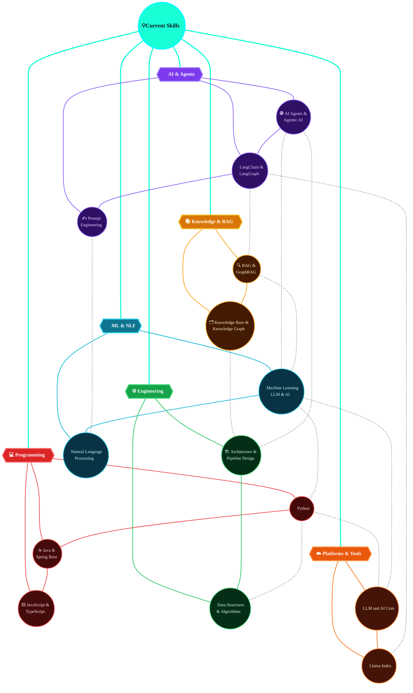

# Hi there ✨, I'm Vikas Kumar

## 🚀 About Me

A passionate developer and tech enthusiast based in Delhi, India. I'm committed to creating software that positively impacts users' lives and continuously pushing the boundaries of what's possible with code.

- 🔭 Currently working on **DevOps & Cloud Computing projects**
- 🌱 Learning **Terraform + Kubernetes** 
- 👯 Looking to collaborate on **Open Source DevOps projects**
- 💬 Ask me about **Docker, Networking, Cloud Architecture**
- ⚡ Fun fact: **I believe technology should serve humanity, not the other way around**

## 🛠️ Tech Stack

### Cloud & DevOps

### Programming Languages

### Web Development

### Also Exploring
🤖 **AI Tools & LLMs** | 📚 **RAG & Knowledge Graphs** | 🧠 **Machine Learning**

## 📊 GitHub Stats

## 🏆 Featured Projects

### [The-Preditor](https://github.com/vikas-032/The-Preditor)
**Stock Analysis with Python** - A comprehensive stock analysis project leveraging data analytics for market insights
- 🔍 Data processing and visualization
- 📊 Market trend analysis
- 🐍 Python-based architecture

### [portfolio-2026](https://github.com/vikas-032/portfolio-2026)
**Modern Portfolio Website** - A responsive portfolio showcasing my work and skills
- 💻 JavaScript development
- 🎨 Clean, modern design
- 📱 Fully responsive

### [community-events-hub](https://github.com/vikas-032/community-events-hub)
**The Heritage** - TypeScript-powered community event management platform
- ⚡ TypeScript development
- 🎯 Event discovery and management
- 👥 Community-focused features

### [DevOps Nexus](https://github.com/vikas-032/myblog03.github.io)
**Tech Blog** - DevOps, Cloud Computing, and Networking tutorials
- 📝 Technical articles
- 🚀 Practical guides
- 🌐 Live on Vercel

## 🌐 Connect With Me

## 📈 Activity

---

⭐ **Star this repo** if you find my work helpful!

📧 **Email:** [7014.vikas@gmail.com](mailto:7014.vikas@gmail.com)

🧭 Also exploring: AI, Agents & RAG (click to expand)

<!---
vikas-032/vikas-032 is a ✨ special ✨ repository because its `README.md` (this file) appears on your GitHub profile.
You can click the Preview link to take a look at your changes.
--->
