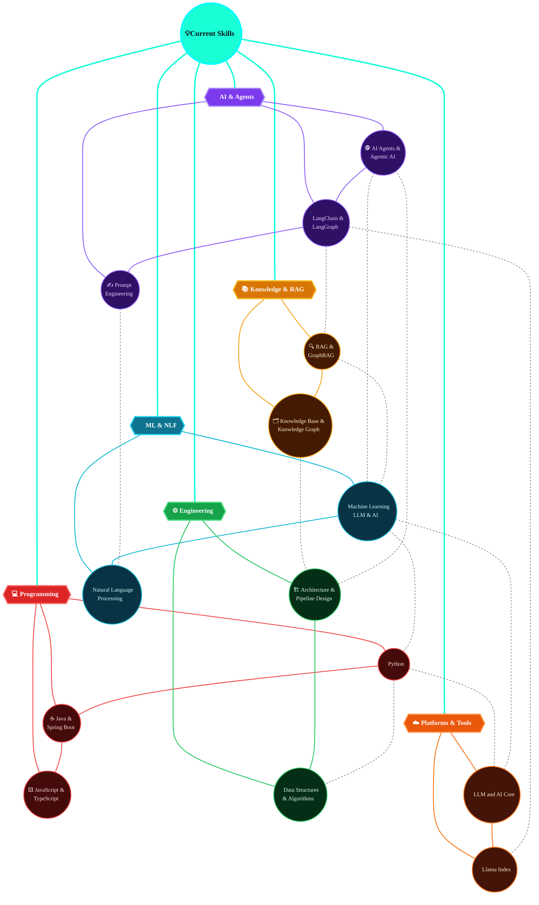

  

<h2>Hi there ✨, I'm Vikas Kumar</h2>

 

## 🌐 Connect with me:

**🌐 Languages**

🤖 Also exploring: AI Tools, LLMs & RAG (click to expand)

 

 

# 📊 GitHub Stats:

 

 

---

🧭 Also exploring: AI, Agents & RAG (click to expand)

<!---
vikas-032/vikas-032 is a ✨ special ✨ repository because its `README.md` (this file) appears on your GitHub profile.
You can click the Preview link to take a look at your changes.
--->
